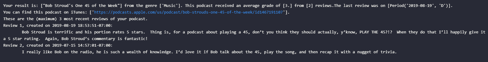
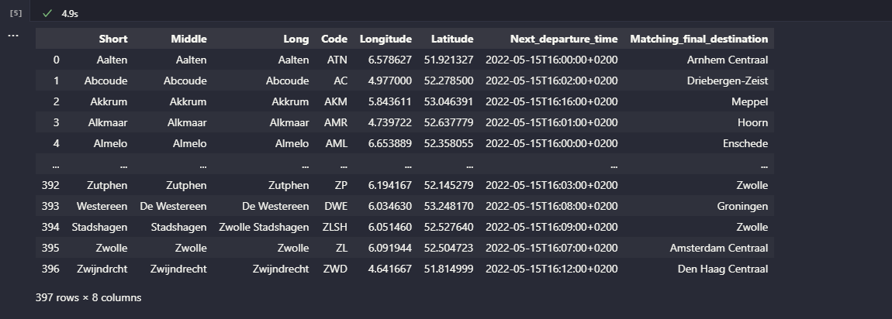
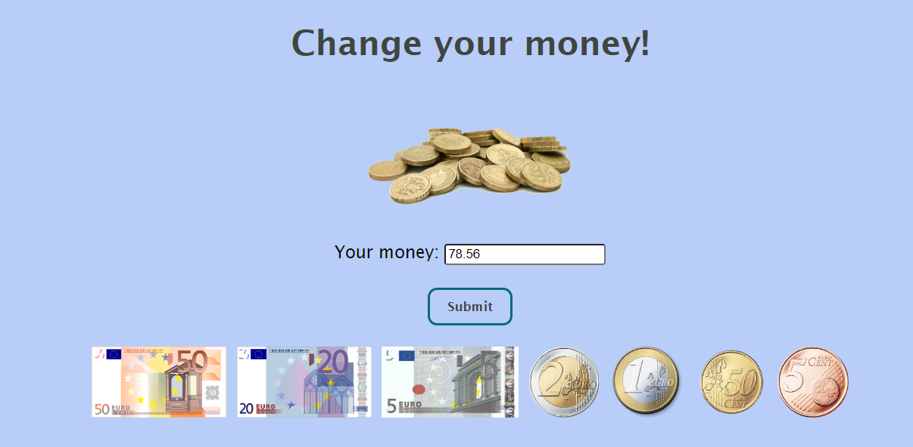

# Kim van Stratum's portfolio

Welcome to my portfolio-page! This is me, Kim van Stratum. I'm 31 years old and live in the Netherlands.
You can find me on [LinkedIn](https://www.linkedin.com/in/kimvanstratum/), feel free to reach out!

I'm sharing some of the projects I have been working on.

Most of these were made when attending my training at Bit Academy in the spring of 2022, but I will add and update with personal projects as well.

## [Podcast analysis and generator](https://github.com/KimvanSt/portfolio/tree/main/podcast)

(Python, Jupyter Notebooks, Pandas, Seaborn, Matplotlib, Numpy)
I analyzed a database with three sets of data on podcasts. These were interlinked by a podcast ID. I retreived and cleaned the data and analyzed which genres were getting most and higher reviews. I also built a random-podcast-generator that gives the user a podcast based on a chosen genre and subgenre, if any.

## [Dutch train times and stations](https://github.com/KimvanSt/portfolio/tree/main/NS-stations)

(Python, Jupyter Notebooks, Pandas, SQL (MySQL))
I used the API of the Dutch national train company to gather the next departures and corresponding final destinations, if any. I filtered out unuseable data and any non-Dutch train station.

## Euro Change Calculator ([Repo](https://github.com/KimvanSt/portfolio/tree/main/changecalculator) or [Repl.it](https://change-calculator.kimm501.repl.co/))

(PHP, HTML, CSS)
I wrote code that accepts an amount of euros and cents from a user, checks it and displays errors if necessary, rounds it to five cents, and outputs the correct change in images of bills and coins.

## Python

1. [I built a basic calculator](https://github.com/KimvanSt/portfolio/blob/main/calculator.py)
2. [I coded a roulette game](https://github.com/KimvanSt/portfolio/blob/main/roulette.py)

## Data collection, cleaning and analysis

### (Python (Jupyter Notebook, Pandas, Seaborn, Matplotlib, Selenium, BeautifulSoup), SQL (MySQL), JSON, Regex)

1. [I wrote code to find a target piece of information in .nbt files](https://github.com/KimvanSt/portfolio/tree/main/minecraft-chests)
2. [I used Regex to find specific people from a large .txt file with address data](https://github.com/KimvanSt/portfolio/tree/main/people-file)
3. [I used Selenium to scrape Amazon for a certain type of laptop, using user input to determine the final page](https://github.com/KimvanSt/portfolio/tree/main/scrape-laptops)
4. [I wrote a Pokémon catcher, fetching JSON information from a website and adding it to a database](https://github.com/KimvanSt/portfolio/tree/main/Pokemon-catcher)

## HTML, CSS, JavaScript

I worked on these in my Web Development Bootcamp (Colt Steele, Udemy) and training at Bit Academy. Will be updated with more JavaScript in the future.

1. [Practiced making a responsive mock hobby-webshop (HTML/CSS)](https://ruudsrommelhok.kimm501.repl.co/index.html)
2. [A simple JavaScript color changer (HTML/CSS/JavaScript)](https://colorpicker.kimm501.repl.co/)
3. [Used Bootstrap to build a landingpage for fictional dogshelter (HTML/CSS/Bootstrap)](https://boopbuddieslanding.kimm501.repl.co/)
4. [Two player Rock, Paper, Scissors (HTML/CSS/JavaScript)](https://rps.kimm501.repl.co/)
