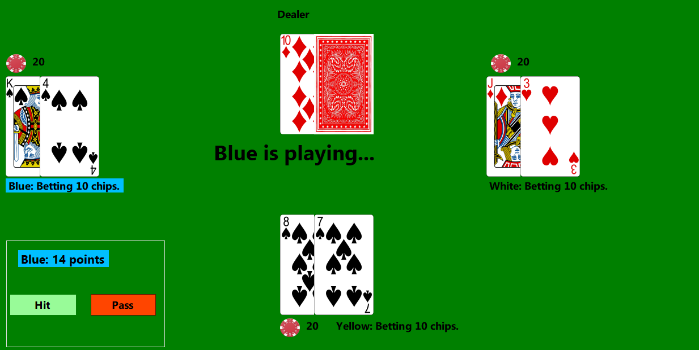

# Kim van Stratum's portfolio

Welcome to my portfolio-page! This is me, Kim van Stratum. I'm 32 years old and live in the Netherlands.
You can find me on [LinkedIn](https://www.linkedin.com/in/kimvanstratum/), feel free to reach out!

I'm sharing some of the projects I have been working on.

They are a mix between projects made during my study at Bit Academy and personal projects.

## [Blackjack in a .NET Windows Forms app](https://github.com/KimvanSt/blackjack-app.git)

(C#, OOP)
I created a Blackjack game in a WinForms app. Up to three players can play against the dealer.

## [Podcast analysis and generator](https://github.com/KimvanSt/portfolio/tree/main/podcast)

(Python, Jupyter Notebooks, Pandas, Seaborn, Matplotlib, Numpy)
I analyzed a database with three sets of data on podcasts. These were interlinked by a podcast ID. I retreived and cleaned the data and analyzed which genres were getting most and higher reviews. I also built a random-podcast-generator that gives the user a podcast based on a chosen genre and subgenre, if any.

## [Dutch train times and stations](https://github.com/KimvanSt/portfolio/tree/main/NS-stations)

(Python, Jupyter Notebooks, Pandas, SQL (MySQL))
I used the API of the Dutch national train company to gather the next departures and corresponding final destinations, if any. I filtered out unuseable data and any non-Dutch train station.

## [Web scraper](https://github.com/KimvanSt/portfolio/tree/main/scrape-laptops)

(Python, Selenium, SQL)
I used Selenium to scrape Amazon for a certain type of laptop, using user input to determine the final page
